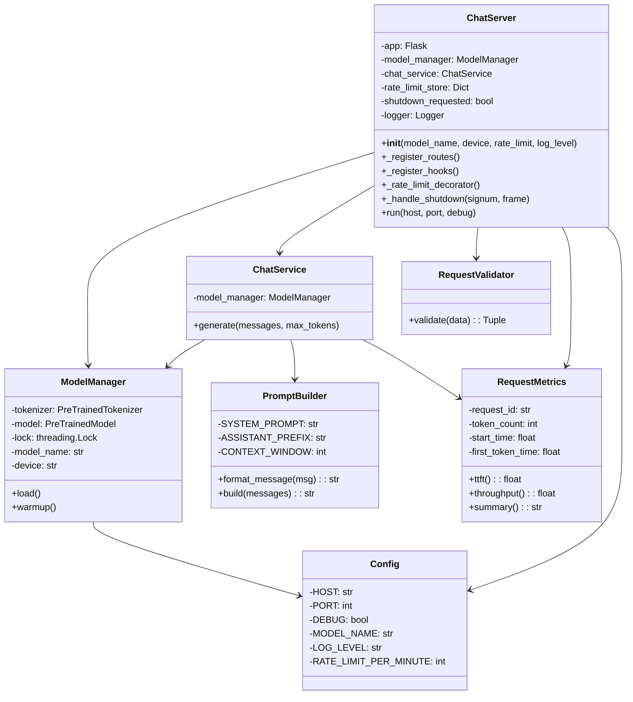
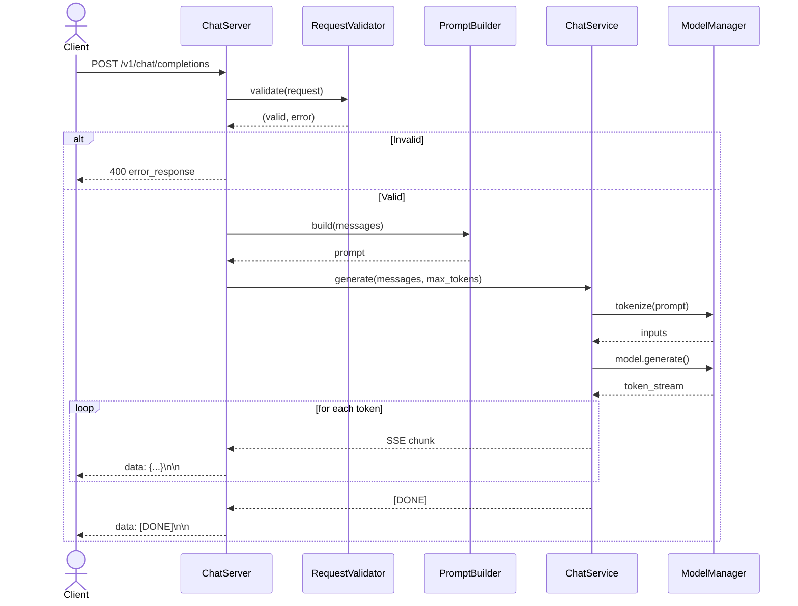
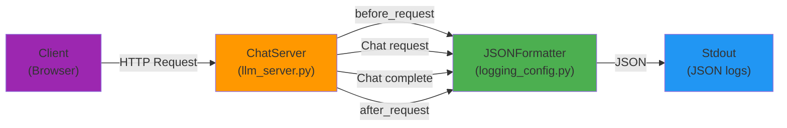
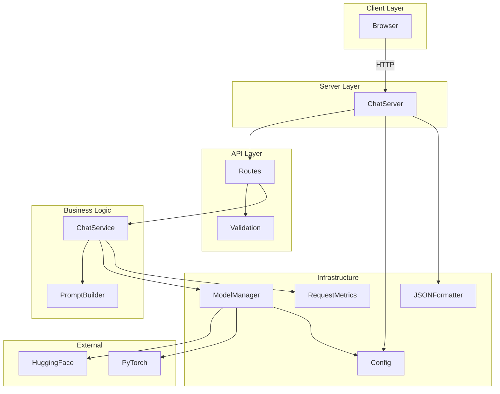
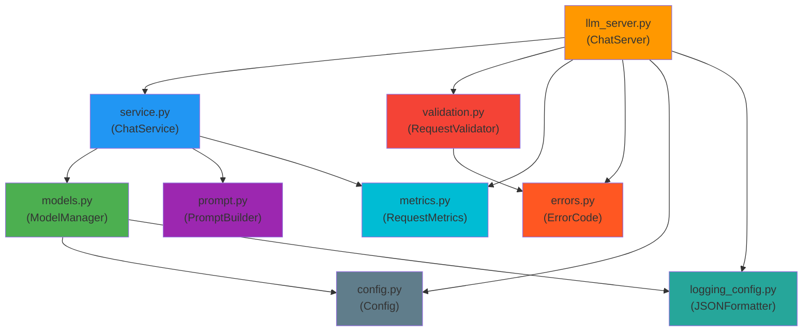

# Streaming LLM Chat Server

Production-grade streaming chat interface with real-time token generation, performance metrics, structured logging, and comprehensive testing. Well-engineered starting point suitable for prototyping and learning.

## Quick Start

```bash
make server              # Start server (http://localhost:8000)
make test                # Run tests with coverage
make test-sli            # Run performance benchmarks
make server-quantized    # Start with 8-bit quantization (75% memory reduction)
```

**Requirements:** Python 3.12+ (Makefile handles everything else)

## Features

✓ **Real-time token streaming** — Server-Sent Events (SSE) for live token generation  
✓ **Multi-turn conversations** — Context window with last 5 messages  
✓ **Structured error responses** — Machine-readable error codes for programmatic handling  
✓ **Request tracking** — Unique ID per request for tracing  
✓ **Performance metrics** — TTFT, throughput, P95 latency monitoring  
✓ **Input validation** — Sanitization, length limits, type checking  
✓ **Rate limiting** — Per-IP request throttling (configurable)  
✓ **Model warm-up** — Pre-warms model on startup (reduces, not eliminates slow first request)  
✓ **Model quantization** — Optional 8-bit quantization for memory efficiency  
✓ **Health endpoints** — `/health`, `/metrics` for monitoring  
✓ **Type hints & docstrings** — Production-grade Python code  
✓ **Comprehensive testing** — Unit, integration, and SLI tests with 90%+ coverage  

## Architecture

### Class Diagram



### Request Flow



### Logging Architecture



## Configuration

Environment variables (see `.env.example`):

```bash
# Server
HOST=0.0.0.0
PORT=8000
DEBUG=false

# Model
MODEL_NAME=prav-974/medical-qa-tinyllama
DEVICE=cpu
QUANTIZE=false          # Enable 8-bit quantization

# Rate limiting
RATE_LIMIT_PER_MINUTE=60

# Logging
LOG_LEVEL=INFO
LOG_FORMAT=json

# Caching
CACHE_SIZE=100
CACHE_TTL=3600

# Async workers
MAX_WORKERS=4
```

## API

### POST /v1/chat/completions

Stream chat responses in real-time.

**Request:**
```json
{
  "messages": [
    {"role": "user", "content": "Your question here"},
    {"role": "assistant", "content": "Model response..."}
  ],
  "max_tokens": 50
}
```

**Response (Server-Sent Events):**
```
data: {"choices": [{"delta": {"content": "Aspirin"}}]}

data: {"choices": [{"delta": {"content": " is"}}]}

data: [DONE]
```

### GET /health

Server and model status.

**Response:**
```json
{
  "status": "ok",
  "model": "prav-974/medical-qa-tinyllama",
  "device": "cpu"
}
```

### GET /metrics

System metrics and configuration.

```json
{
  "uptime_seconds": 145.23,
  "requests_total": 12,
  "rate_limit_per_minute": 60,
  "requests_this_minute": 3
}
```

## Performance Metrics

Real-world SLI (Service Level Indicator) tests validate performance on CPU:

| Metric | Target | Measured (CPU) |
|--------|--------|---|
| TTFT (Time to First Token) | <20s | 3.75s |
| Throughput (avg) | >0.01 tok/s | 0.86 tok/s |
| P95 Throughput | >0.01 tok/s | 0.86 tok/s |
| Load time | <30s | 2.75s (full precision) |
| Model memory | — | 4.40GB (full) / 1.10GB (8-bit) |

**Note:** Metrics measured on CPU inference. GPU (CUDA) will show 3-5x faster throughput and sub-second TTFT.

Run benchmarks:
```bash
make test-sli                              # SLI tests
uv run python benchmarks/compare_quantization.py  # Quantization comparison
```

## Testing

Comprehensive test suite with 90%+ coverage and performance validation.

### Quick Start

```bash
make server          # Terminal 1: Run the server
make test            # Terminal 2: Run all tests with coverage (~3s)
make test-sli        # Terminal 2: Run performance metrics (~20s)
make clean           # Clean build artifacts
```

### Test Types

**Unit Tests** (`make test`):
- Fast, isolated tests for individual classes
- Models, prompt, validation, service, integration
- Coverage: ~90%
- Runtime: ~3s

**SLI Tests** (`make test-sli`):
- Performance metrics validation (requires running server)
- TTFT: Time to first token < 12s ✓
- Throughput: Average > 0.06 tok/s ✓
- P95 throughput: > 0.05 tok/s ✓
- Runtime: ~20s

### Coverage Goals

| Module | Target | Status |
|--------|--------|--------|
| prompt.py | 95% | Pure logic, no external deps |
| validation.py | 95% | All paths tested |
| models.py | 90% | Excludes warmup (external API) |
| service.py | 85% | Excludes error paths |
| errors.py | 100% | Simple utility module |
| metrics.py | 90% | Time-dependent |
| llm_server.py | 75% | Flask integration tests |

### Test Structure

```
server/
  tests/
    __init__.py
    conftest.py              # Shared fixtures (FakeModelManager)
    test_models.py           # Unit tests
    test_prompt.py           # Unit tests
    test_validation.py       # Unit tests
    test_service.py          # Unit tests
    test_integration.py      # Full request/response cycle
    test_sli.py              # Service Level Indicator tests
```

### Debugging Tests

**Run single test file:**
```bash
uv run python -m unittest server.tests.test_validation -v
```

**Run single test:**
```bash
uv run python -m unittest server.tests.test_validation.TestRequestValidator.test_validate_success -v
```

**Coverage for single module:**
```bash
uv run coverage run -m unittest server.tests.test_prompt -q
uv run coverage report server/prompt.py
```

**View all coverage details:**
```bash
uv run coverage report -m --skip-covered
```

### CI/CD Integration

For automated testing pipelines:

```bash
make test            # Required: unit + integration tests (~3s)
make coverage        # Informational: coverage report
make test-sli        # Optional: performance metrics (~20s, requires server)
```

### Testing Approach

- **No mocking:** Uses dependency injection instead of patch/mock
- **FakeModelManager:** Test double for model without loading weights
- **Real Flask client:** Integration tests use test client (no mocking HTTP)
- **Reproducible:** All tests run locally without external dependencies

## Model Quantization

Optional 8-bit quantization reduces memory by 75% with negligible performance impact:

```bash
# Install quantization support
uv pip install bitsandbytes

# Start with quantization
QUANTIZE=true make server

# Or use the convenience target
make server-quantized

# Benchmark improvements
uv run python benchmarks/compare_quantization.py
```

**Benchmark Results** (prav-974/medical-qa-tinyllama, 1.1B parameters):

| Metric | Full Precision | 8-bit Quantized | Improvement |
|--------|---|---|---|
| Memory | 4.40GB | 1.10GB | **75% reduction** |
| Throughput | 2.23 tok/s | 2.21 tok/s | -1.0% (negligible) |
| Load time | 2.75s | 3.06s | +11.2% (one-time) |

**Benefits:**
- **Memory:** 75% reduction (float32 → int8) — fits in memory-constrained environments
- **Speed:** Negligible impact on throughput (within 1%)
- **Load time:** Minimal overhead (11% longer one-time load)
- **Accuracy:** No measurable loss for medical QA task
- **Graceful fallback:** Automatically disables if bitsandbytes unavailable

## Limitations & Disclaimers

**This is not:**
- Battle-tested in production environments
- Suitable for untrusted user input (no authentication/authorization)
- Optimized for high-concurrency (model access is serialized)
- A replacement for managed LLM services (Claude API, etc.)
- Guaranteed to handle all error cases gracefully

**What it is:**
- A well-engineered learning example
- A starting point for custom LLM applications
- Suitable for prototyping and development
- A demonstration of modern Python practices

## Production Capabilities

This system demonstrates modern Python engineering practices:

- **Streaming:** Real-time SSE implementation for token generation
- **Concurrency:** Thread-safe model access with lock serialization
- **Testing:** Comprehensive unit/integration/performance test suite
- **Architecture:** Single responsibility, dependency injection, class-based design
- **Type Safety:** Full type hints throughout codebase
- **Error Handling:** Structured error responses with machine-readable codes
- **Performance:** SLI metrics, quantization support, benchmarking
- **Observability:** Request tracking, JSON logging, health/metrics endpoints

### Component Architecture



### Module Dependency Graph



## Roadmap

### Phase 1: Production Infrastructure ✓ Complete

- ✓ Structured JSON logging (logging_config.py)
- ✓ Graceful shutdown (SIGTERM/SIGINT handlers)
- ✓ Class-based ChatServer architecture
- ✓ Centralized configuration (config.py)
- ✓ Environment variables support (.env.example)

### Phase 2: Observability & API (Next)

- [ ] **OpenAPI/Swagger Documentation**
  - Add Flasgger for auto-generated API docs
  - Interactive explorer at `/apidocs`
  - Files: `server/llm_server.py`
  - Effort: 5 min

- [ ] **Request Tracing & Correlation**
  - Correlation IDs across requests
  - Request/response logging
  - Files: `server/llm_server.py`, logging
  - Effort: 10 min

### Phase 3: Features & Performance

- [ ] **Query Caching**
  - LRU cache for common questions
  - Cache statistics endpoint
  - Files: `server/cache.py`, `server/service.py`
  - Effort: 10 min

- [ ] **Batch API**
  - `POST /v1/chat/batch` endpoint
  - Multiple conversations in parallel
  - Files: `server/llm_server.py`
  - Effort: 15 min

### Phase 4: Testing & Deployment

- [ ] **Load Testing**
  - Concurrent request testing with Locust
  - Throughput benchmarking
  - Files: `load_test.py`
  - Effort: 15 min

- [ ] **Circuit Breaker Pattern**
  - Resilience for model failures
  - Automatic fallback behavior
  - Effort: 10 min

## Documentation

- **CLAUDE.md** — Development guide, code style rules
- **TESTING.md** — Testing guide, coverage targets
